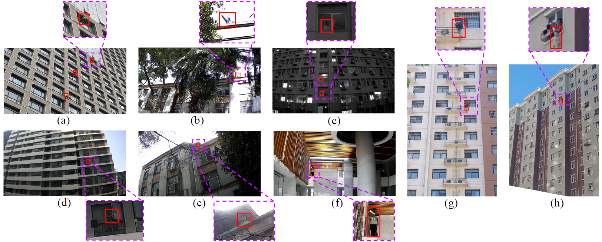
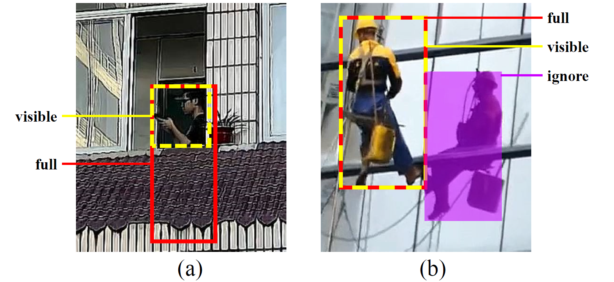

# EBPersons: A Dataset for Person Detection at the Edges of Buildings

## Introduction
EBPersons is a novel dataset specifically designed for Person Detection at the Edges of Buildings (PDEB). With the increasing prevalence of buildings, incidents of falling from heights have become more frequent, making the accurate detection of individuals at the edges of buildings crucial for timely intervention and accident prevention. This dataset provides a rich and challenging benchmark for PDEB research, comprising 1,314 videos captured across over 300 diverse building scenes with diverse lighting conditions.

## Examples
Below are examples of images from the EBPersons dataset, showcasing the diversity in illumination, scene, and human pose. The captured person instances are usually small and occluded.




## Data Collection
The EBPersons dataset was constructed using a two-pronged data collection strategy:
1. **Original Footage**: Captured by staging scenarios with volunteers performing various actions near the edges of buildings, using wide dynamic range cameras with CMOS sensors and dot matrix LED infrared lamps.
2. **Publicly Available Videos**: Selected from platforms like YouTube and Baidu, depicting individuals at the edges of buildings, filmed from tilt-upward angles.

## Data Annotation
Each person in an image is annotated with two bounding boxes: one for the visible region of the person’s body and the other for the full body. Annotators estimate the location of occluded body parts when drawing the full bounding box. People depicted in posters, statues, mannequins, and reflections are marked as ignored regions and are not annotated.



## Download Dataset
The EBPersons dataset and baseline code are publicly available for non-commercial research use under the CC BY-NC-SA 4.0 license. You can access the dataset and download it from the official website:
[EBPersons Dataset Download](https://ebpersons.github.io/download.html) 


## How to Use
To use the EBPersons dataset, follow these steps:
1. Download the dataset from the provided link.
2. Extract the contents of the downloaded archive. The folder structure will be as following:
```
├── data
│   ├── cocovid_all
│   │   ├── Data
|   │   │   ├── train
|   │   │   ├── val
│   │   ├── annotations
```

There are 2 JSON files in `data/cocovid_all/annotations`:

`coco_vid_annotations_train.json`: JSON file contains the annotations information of the training set in EBPersons dataset.

`coco_vid_annotations_val.json`: JSON file contains the annotations information of the validation set in EBPersons dataset.

3. Follow the instructions in 'run.sh' and [quick_run](https://github.com/open-mmlab/mmtracking/blob/master/docs/en/quick_run.md) for specific usage guidelines and any additional requirements. The weight of the baseline method can be downloaded in [baseline weights](https://drive.google.com/file/d/1_AQOY1KB14y1d8MeNY88E85iggN2PhSh/view?usp=drive_link)

## Ethical Considerations
All individuals appearing in the videos shot by us are volunteers who provided informed consent after receiving a full explanation of the project’s purpose and data collection procedures. Necessary authorization was obtained from relevant organizations to conduct video shooting within the vicinity of the buildings. All corresponding authorization documentation is available on the dataset website.
